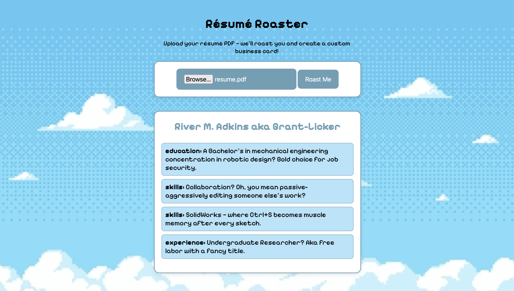

# Resume Roaster

Resume Roaster is a lightweight web application that humorously critiques resumes using rule-based pattern matching. 
I built it as a fun side project, which felt very relevant in a difficult job market where everyone is so focused on optimizing their resumes. 
It also served as a great way to practice my JavaScript and rapid web deployment.

The system is intentionally simple and transparent, favoring fast, explainable feedback over complex machine-learning models.

**Live site:** https://radkinz.com/resume-roaster/website/

---

## How It Works

1. A user uploads their resume as a pdf.
2. After converting the pdf into a massive string, which is decomposed by section. The JavaScript logic applies a set of handcrafted rules and patterns to identify common resume patterns.
3. Each detected pattern maps to a list of various short, humorous critiques, and one is picked by random.
4. Results are returned instantly with no external API calls or model inference.

The project deliberately avoids machine learning in favor of:
- Full control over outputs
- Predictable behavior
- Easy extensibility and debugging

---

## Features

- Fully client-side resume analysis (runs entirely in the browser)
- Rule-based text analysis using pattern matching
- Instant feedback with no server requests or data storage
- Lightweight UI

---

## Local Development

```bash
git clone https://github.com/radkinz/resume-roaster.git
cd resume-roaster
python3 -m http.server
```
---

## Example Roast


